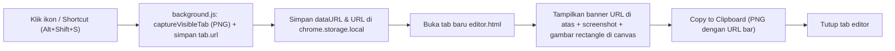

# Plan: Chrome Extension Screenshot + Editor (QA, Lokal)

## Tujuan
Klik ikon/shortcut → screenshot **tampilan layar saat ini** (viewport tab, selebar layar) → buka tab baru berisi editor → gambar **rectangle** → **Copy to Clipboard** → tab editor **tertutup otomatis**. Tanpa save/download. Dipakai lokal (load unpacked).

## Keputusan
- Capture: **apa yang tampil di layar** (viewport tab aktif sesuai lebar layar komputer).
- Header URL: **Otomatis menambahkan bar URL & timestamp** di sisi atas screenshot tanpa menutupi konten web.
- Tool: **hanya Rectangle** (pilihan warna, ketebalan, undo).
- Tab editor **ditutup otomatis** setelah berhasil copy ke clipboard.

## Alur Kerja


## Tech Stack
- Chrome Extension Manifest V3
- Vanilla HTML, CSS, JavaScript (tanpa build tools/dependencies tambahan)
- Canvas 2D API
- Permissions: `activeTab`, `storage`, `clipboardWrite`

## Struktur File
```
my-screenshot-app/
├── PLAN.md                  # Dokumentasi plan
├── manifest.json            # Konfigurasi Manifest V3
├── background.js            # Background service worker (capture tab & buka editor)
├── editor/
│   ├── editor.html          # Halaman editor screenshot
│   ├── editor.css           # Styling editor & toolbar modern
│   └── editor.js            # Logika canvas, drawing rectangle, undo, copy & auto-close
└── icons/
    ├── icon16.png
    ├── icon48.png
    └── icon128.png
```

## Fase Pengerjaan
1. **Manifest & Setup Dasar**:
   - Buat `manifest.json` (MV3) dengan permissions `activeTab`, `storage`, `clipboardWrite`, deklarasi action & shortcut default (`Alt+Shift+S`).
   - Buat file ikon dasar (`icons/icon*.png`).
2. **Background Service Worker (`background.js`)**:
   - Tangkap event klik ekstensi / shortcut.
   - Panggil `chrome.tabs.captureVisibleTab` (format PNG).
   - Simpan image data URL ke `chrome.storage.session`.
   - Buka tab baru mengarah ke `editor/editor.html`.
3. **Editor UI & Canvas (`editor/`)**:
   - `editor.html`: Container toolbar (pilih warna, pilihan ukuran stroke, tombol Undo, tombol Copy to Clipboard) dan canvas.
   - `editor.css`: UI modern, minimalis, dan nyaman untuk alur kerja QA.
   - `editor.js`:
     - Ambil screenshot dari `chrome.storage.session` dan render ke canvas.
     - Implementasi interaksi mouse drag untuk menggambar **Rectangle** (outline).
     - Fitur Undo history (stack state canvas).
4. **Copy to Clipboard & Auto-Close**:
   - Export canvas ke blob PNG menggunakan `canvas.toBlob`.
   - Salin ke clipboard menggunakan `navigator.clipboard.write([new ClipboardItem({'image/png': blob})])`.
   - Berikan visual feedback cepat ("Copied!"), kemudian panggil `window.close()` untuk menutup tab secara otomatis.
5. **Instalasi Lokal**:
   - Buka `chrome://extensions` → Aktifkan Developer mode → Klik **Load unpacked** dan arahkan ke folder `my-screenshot-app`.
